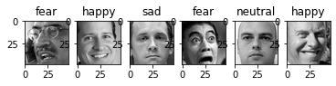

# Facial Emotion Recognition using VGG16 + Custom CNN Ensemble

**Neural Networks Project**  
Real-time facial emotion detection – 7 emotions: Angry, Disgust, Fear, Happy, Sad, Neutral, Surprise

**Final Test Accuracy: 63.4%** (Ensemble Model)  
**Training Accuracy: 85.9%**  
**Dataset:** FER2013 (48×48 grayscale → converted to RGB)

**Trained on Google Colab with GPU**  
Fully reproducible — just open in Colab!

[](https://colab.research.google.com/github/yourusername/Facial-Emotion-Recognition-Ensemble/blob/main/NN_project.ipynb)

---

### Project Highlights
- Transfer Learning with **VGG16** (fine-tuned)
- Custom CNN trained from scratch
- **Weighted Ensemble** (60% VGG16 + 40% Custom CNN)
- Achieved **63.4% test accuracy** — strong result on challenging FER2013

---

### Results
| Model                  | Val Accuracy | Test Accuracy |
|------------------------|--------------|---------------|
| Custom CNN (Grayscale) | 41.1%        | ~42%          |
| VGG16 Fine-tuned (RGB) | 59.1%        | 58–60%        |
| **Ensemble (Best)**    | **63.6%**    | **63.4%**     |

---

### Visualizations
  
  


---

### How to Run (2 Ways)

**Option 1 – Google Colab (Recommended)**  
Click the badge above → runs instantly with free GPU!

**Option 2 – Local**
```bash
git clone https://github.com/yourusername/Facial-Emotion-Recognition-Ensemble.git
cd Facial-Emotion-Recognition-Ensemble
pip install -r requirements.txt
jupyter notebook

Download FER2013 from Kaggle → https://www.kaggle.com/datasets/msambare/fer2013

Geetha
Neural Networks Project
Developed & trained entirely on Google Colab